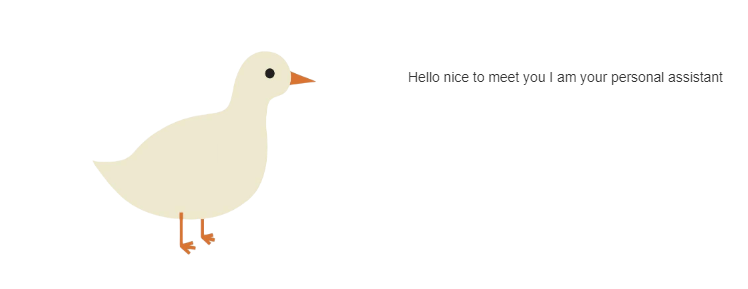
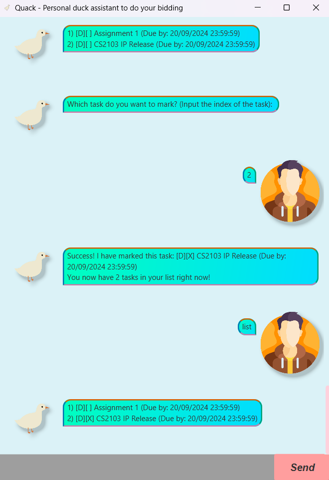
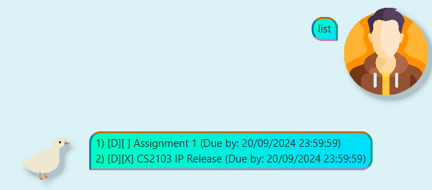
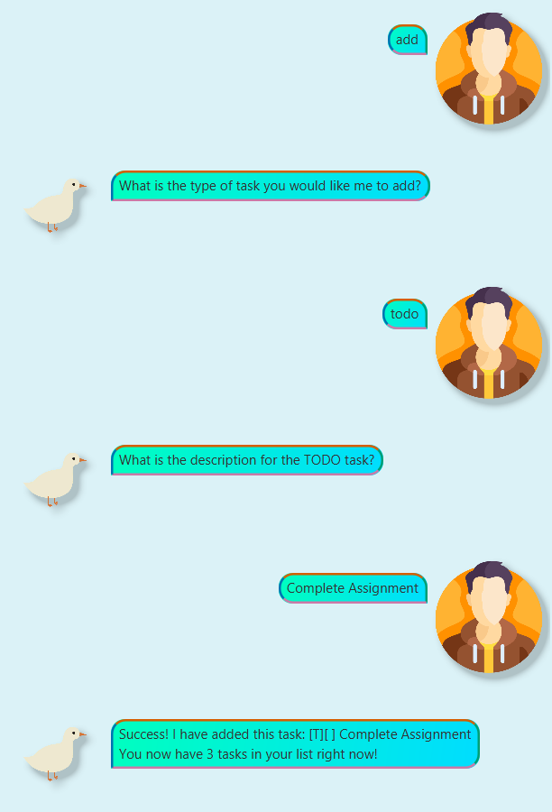
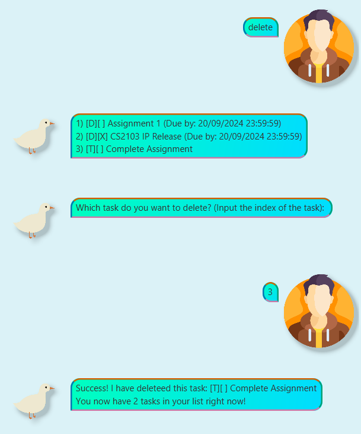
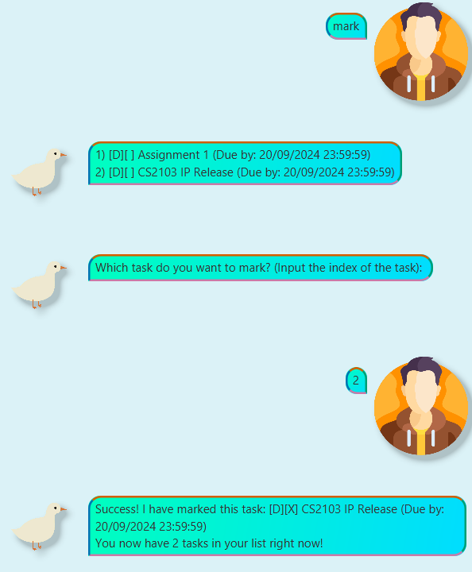
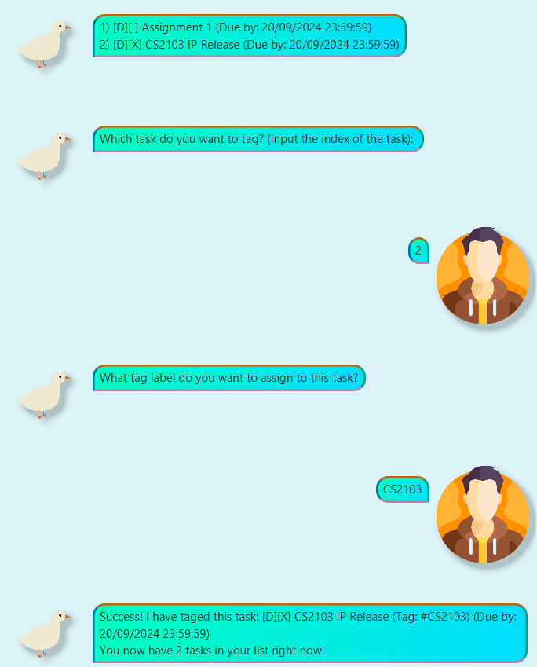
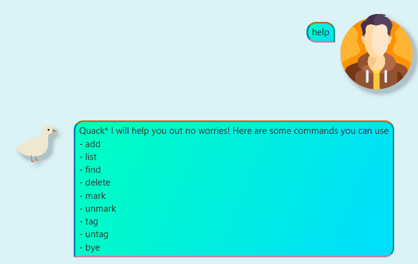

# Quack - Your Personal Duck Assistant 

## What is Quack
Quack is a user friendly assistant which helps you keep track of pesky tasks and ensures you don't miss out on anything important!

## Supported Features
Here is a list of feaures that quack supports
   1) List your tasks
   2) Add a todo/deadline/event task
   3) Find tasks inside yourlist
   4) Delete tasks in your list
   5) Mark or unmark tasks in your list
   6) Tag or untag tasks inside your list for better organisation
   7) A help feature to list all possible commands

# Setting up Quack

If you are using the `.jar` to run the program please skip to the __quick start__ portion of the guide.

## InteliJ
   Prerequisites: JDK 17, update Intellij to the most recent version.

   1. Open Intellij (if you are not in the welcome screen, click `File` > `Close Project` to close the existing project first)
   2. Open the project into Intellij as follows:
      - Click `Open`.
      - Select the project directory, and click `OK`.
      - If there are any further prompts, accept the defaults.
   3. Configure the project to use **JDK 17** (not other versions) as explained in [here](https://www.jetbrains.com/help/idea/sdk.html#set-up-jdk). 
      In the same dialog, set the **Project language level** field to the `SDK default` option.
   4. Ensure Gradle is installed
   5. After that, run gradle either by CLI `gradle run` or using the inbuilt Gradle GUI in IntelliJ. Running `gradle build` is optional but recommended

## VSCode
   For VSCode :
   1. Open VSCode
   2. Open the project into VSCode as follows:
      - Click `File` then `Open Folder`.
      - Select the project directory, and click `OK`.
      - If there are any further prompts, accept the defaults.
   3. Configure the project to use **JDK 17** (not other versions) as explained in [here](https://www.jetbrains.com/help/idea/sdk.html#set-up-jdk). 
   4. Ensure Gradle is installed
   5. After that, run gradle either by CLI `gradle run` or using the inbuilt Gradle GUI on the side pannel to the left/right. Running `gradle build` is optional but recommended

## Quick Start by Running the JAR file

   1. Ensure you have JDK-17.0.12 or equivalent is installed locally in your Computer
   2. Download the latest `.jar` file from here
   3. Copy the file to the folder you want to use as the home folder for Quack.
   4. Open a command terminal, `cd` into the folder you put the `.jar` file in, and use the following command`java -jar quack.jar` to run the application.

> Please note that A GUI similar to the below should appear in a few seconds. Note that the image shows some sample data and some uage examples.

   4. Type a command in the text input at the bottom and press Send to execute it
   5. For what commands to type, just key in `help` into the text input

# Features

>Do note that the images to display expected outcomes uses sample data

## Listing Tasks - `list`
Displays a list of all tasks that is being kept track of by Quack.

Format: `list`

__Sample Output:__
 

## Listing Tasks - `add`
Adds a todo, deadline or event task into Quack's task list.

Depending on what task type Quack will prompt you the necessary information part by part.

Format
- `add`
- `<Task Type>`
- `<Task information>`

__Example__:
- `add`
- < Quack will prompt you what type of task you want to add >
- `todo`
- < Quack will prompt you the task description >
- `Complete assignment`

> For deadline and event tasks, Quack will prompt you for some date input in ths following format: DD/MM/YYYY HH:MM:SS

__Sample Output:__
 

## Finding Tasks - `find`
Ask Quack to find all tasks that matches the description or contains a substring of the description.

Format
- `find`
- `<Task description>`

__Example:__
- `find`
- < Quack will prompt you what task you will like to find >
- `Assignment`

__Sample Output:__
 

## Deleting Tasks - `delete`
Ask Quack to delete a task from the list based on the tasks index.

Format
- `delete`
- `<Task index as shown in the list>`

__Example:__
- `delete`
- < Quack will prompt you what task you will like to delete >
- `3`

__Sample Output:__
 

## Marking and Unmarking Tasks - `mark` & `unmark`
You can ask Quack to mark and unmark tasks based on the tasks index.

Format
- `mark` or `unmark`
- `<Task index as shown in the list>`

__Example:__
- `mark`
- < Quack will prompt you what task you will like to mark >
- `2`

__Sample Output:__
 

## Tagging and Untagging Tasks - `tag` & `untag`
You can ask Quack to tag or untag tasks to organise your tasks.

Format
- `tag` or `untag`
- `<Task index as shown in the list>`
- `<Tag label>`

__Example:__
- `tag`
- < Quack will prompt you what task you will like to tag >
- `2`
- < Quack will prompt you for the tag lable>
- `CS2103`

> For untagging Quack will not prompt you for a tag label

__Sample Output:__
 

## Help function - `help`
In the event the user forgets the commands to type, they can ask quack to list it out.

Format
- `help`

__Example:__
- `tag`
- < Quack will print all the supported commands >

__Sample Output:__
 

## Exiting the program - `bye`
This is to close the program properly

Format
- bye`

__Example:__
- `bye`
- < Quack will stop running >

> After awhile the window will be closed after the `bye` command is executed

__Sample Output:__
 

## Saving & loading of tasks
Quack will save any data automatically once the `bye` command has been executed. There is no need to manually save.

Quack will also automatically load in the saved data when the program first runs.

# References

## Website to generate the ASCII Logo
The website to generate the ASCII Logo can be found [here]((https://www.google.com/url?sa=t&rct=j&q=&esrc=s&source=web&cd=&cad=rja&uact=8&ved=2ahUKEwjNkMjnx_6HAxVN6zgGHSk9NLYQFnoECBwQAQ&url=https%3A%2F%2Fpatorjk.com%2Fsoftware%2Ftaag%2F&usg=AOvVaw1rmNDfu2i-RQ4_TslxEwcR&opi=89978449)).

## Profile Pictures

### Duck Icon

For the duck icon it was retrieved [here](https://www.vecteezy.com/vector-art/25668392-simple-and-adorable-flat-colored-white-duck-illustration).

### Person Icon

For the person icon it was retrieved [here](https://www.flaticon.com/free-icon/man_4140061).
